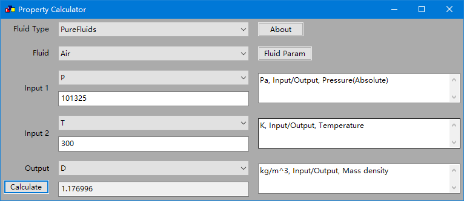
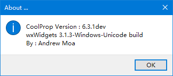
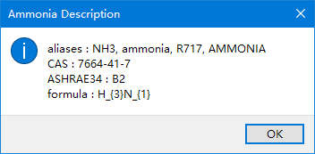

# wxCoolProp

A simple GUI application for CoolProp.

## Build

MSVC

```bash
cmake -G"Visual Studio 16 2019" -A x64 -S path/to/src -DwxWidgets_ROOT_DIR=path/to/wxmsw -DwxWidgets_LIB_DIR=path/to/wxmsw/lib -DwxWidgets_USE_UNICODE=ON -DwxWidgets_USE_DEBUG=OFF -DwxWidgets_USE_STATIC=ON -DCOOLPROP_SRC_DIR=path/to/coolprop/src -DCOOLPROP_LIB_DIR=path/to/coolprop/static/lib
cmake --build . --config Release
```

MINGW

```bash
cmake -G"MinGW Makefiles" -S path/to/src -DwxWidgets_ROOT_DIR=path/to/wxmsw -DwxWidgets_LIB_DIR=path/to/wxmsw/lib -DwxWidgets_USE_UNICODE=ON -DwxWidgets_USE_DEBUG=OFF -DwxWidgets_USE_STATIC=ON -DCOOLPROP_SRC_DIR=path/to/coolprop/src -DCOOLPROP_LIB_DIR=path/to/coolprop/static/lib
cmake --build . --config Release
```

## Screenshot






